# EXERCISE PROFILING

## Tutorial 5

### Sebelum optimasi

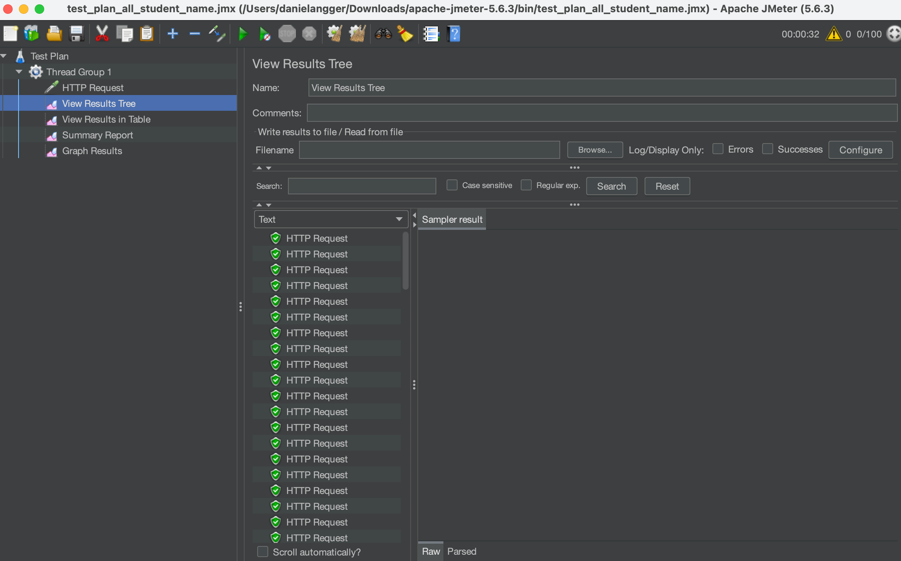  
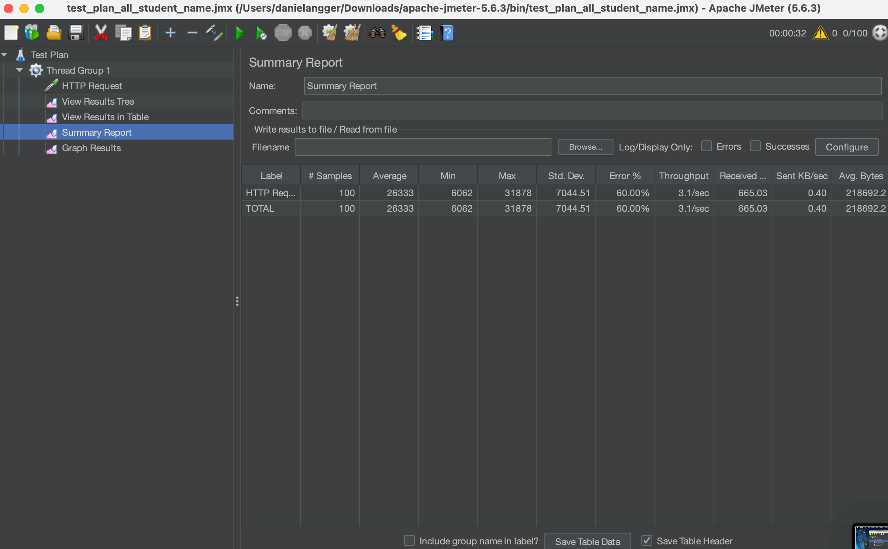  
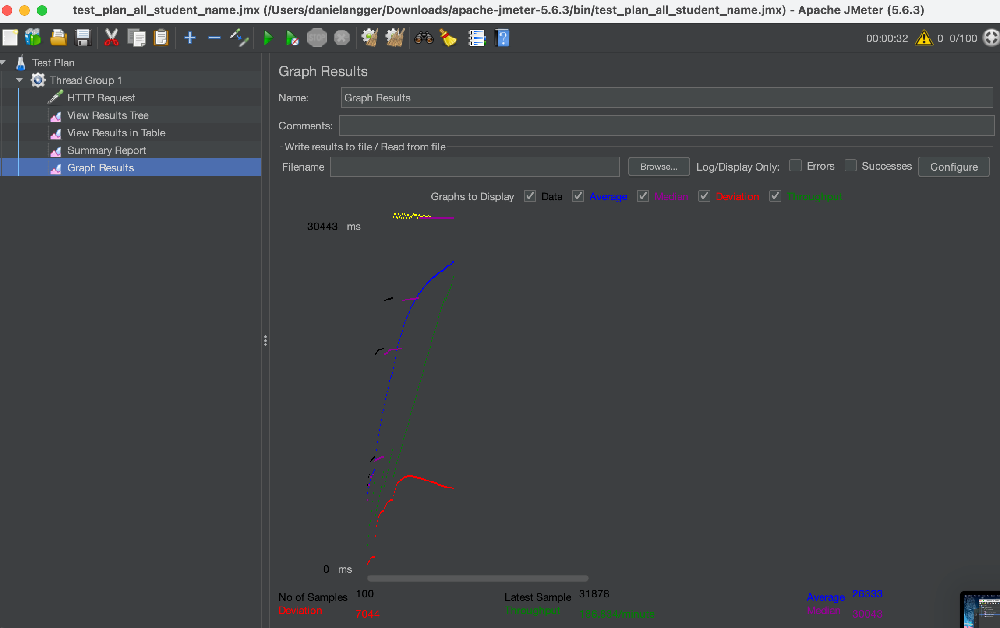  
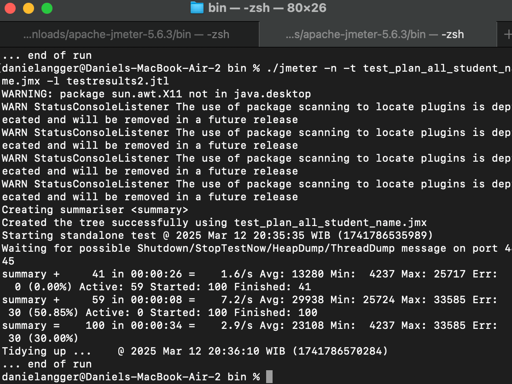  
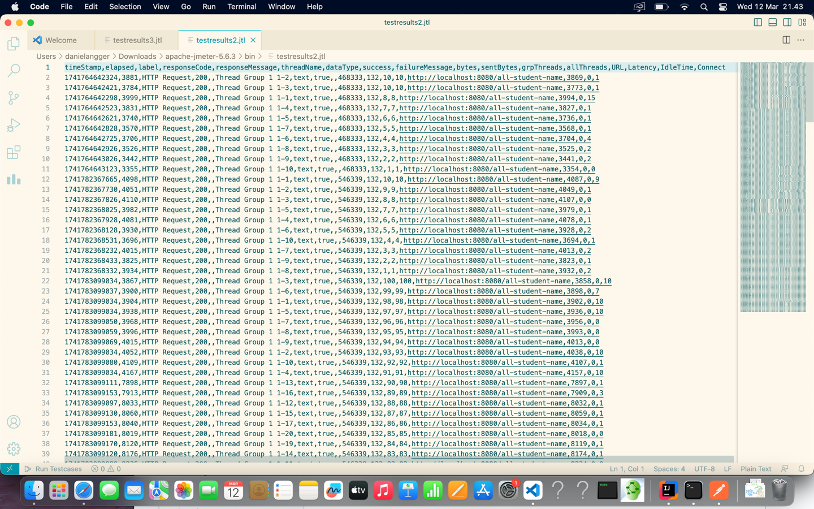

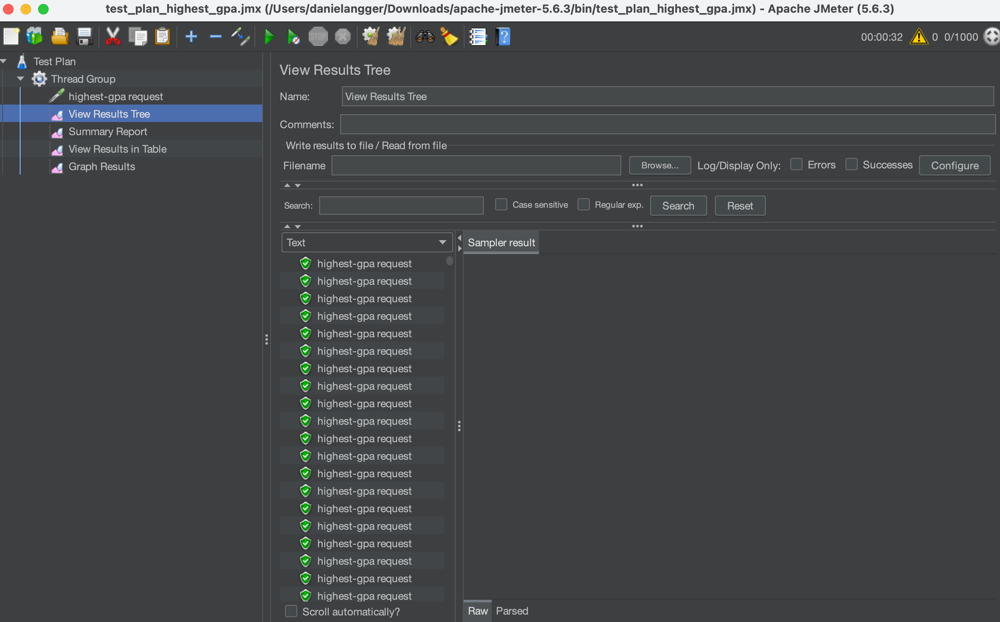  
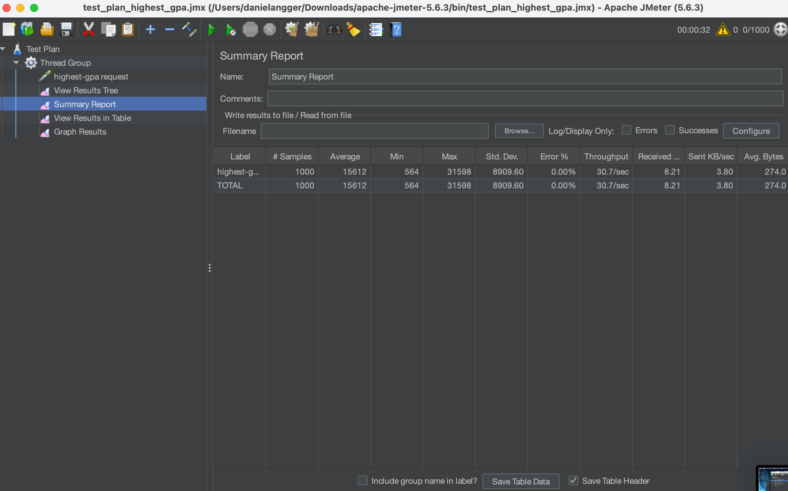  
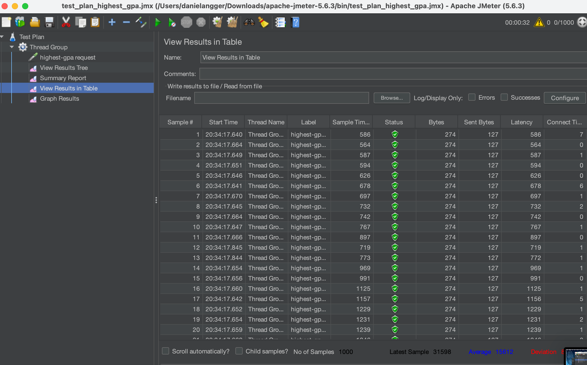  
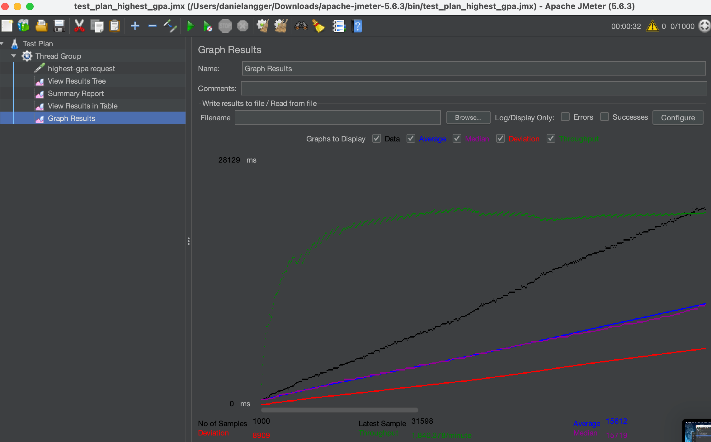  
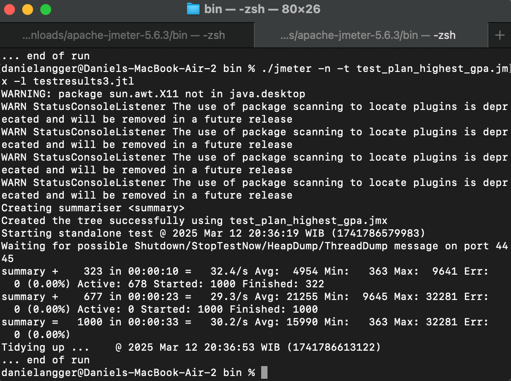  
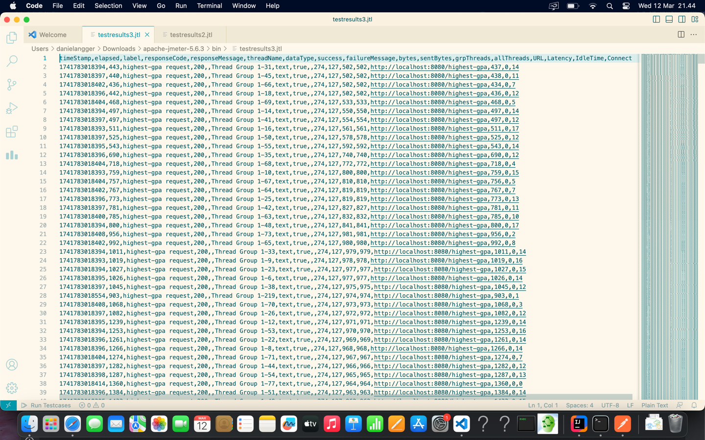

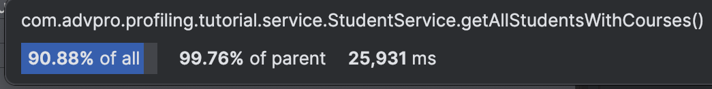  
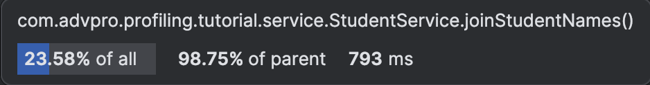  
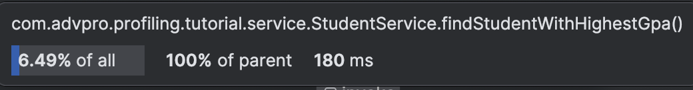

### Setelah optimasi
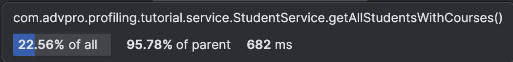  
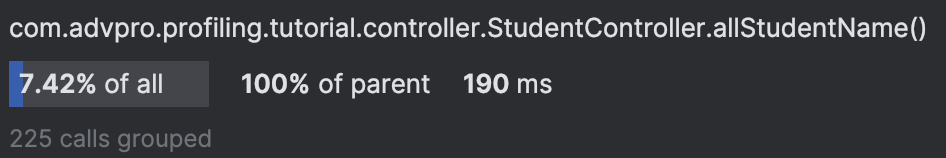  
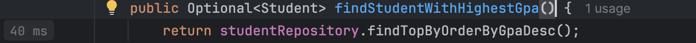  

1. Pendekatan performance testing dengan JMeter dan profiling dengan IntelliJ Profiler memiliki tujuan yang berbeda dalam mengoptimalkan performa aplikasi, misalnya:
   > 1. JMeter (Performance Testing):  
   -. Digunakan untuk menguji performa aplikasi dalam skenario nyata dengan beban yang bervariasi.  
   -. Fokus pada simulasi pengguna secara bersamaan untuk mengidentifikasi bottleneck seperti latensi tinggi, throughput rendah, dan resource exhaustion.  
   -. Cocok untuk pengujian load testing, stress testing, dan scalability testing.  
   -. Menghasilkan laporan berbasis metrik seperti response time, error rate, dan concurrency handling.  

   > 2. IntelliJ Profiler (Profiling)  
   -. Digunakan untuk menganalisis performa kode secara mendalam di level metode dan thread.  
   -. Fokus pada optimasi kode dengan mengidentifikasi hotspot, memory leaks, dan CPU usage.  
   -. Cocok untuk debugging performa dengan insight detail tentang eksekusi aplikasi.  
   -. Membantu mengoptimalkan algoritma dan pemanfaatan resource dalam kode.  

2. Proses profiling membantu mengidentifikasi dan memahami titik lemah dalam aplikasi dengan cara berikut:

   > -. Mengukur Penggunaan CPU & Hotspot  
     -. Menganalisis Penggunaan Memori & Memory Leaks  
     -. Memantau Thread & Concurrency Issues  
     -. Menganalisis I/O dan Database Query  
     -. Visualisasi dan Insight yang Mendalam  

3. Ya, IntelliJ Profiler sangat efektif dalam membantu menganalisis dan mengidentifikasi bottleneck dalam kode aplikasi karena saat saya menggunakan IntelliJ Profiler, saya bisa menganalisa penggunaan CPU time maupun penggunaan memori. Profiler IntelliJ juga memberikan feedback terkait kode kita. Dengan berbekal ini semua, saya bisa mengoptimasi kode saya dengan maksimal.

4. Tantangan utama saya saat melakukan test performance adalah kesabaran. Saat saya menggunakan JMeter dan membuat 10 user saja mengakses aplikasi saya mungkin itu tidak terlalu berasa, tetapi ketika saya meng-assign 1000 atau 100 user barulah terasa, dan saya menunggu feedbacknya. Setelah itu, tantangannya adalah mengoptimasi kode saya, yang juga sulit karena sebenarnya itu bukan kode saya, jadi saya harus memahaminy dahulu, yang saya lakukan dengan mencari dokumentasi dari berbagai macam sumber.

5. Menggunakan IntelliJ Profiler untuk profiling kode aplikasi memberikan beberapa manfaat utama, misalnya:
   > -. Identifikasi Bottleneck dengan Akurat  
   -. Deteksi dan Perbaikan Memory Leaks  
   -. Pemantauan Performa Thread & Concurrency  
   -. Berguna dalam aplikasi multithreading untuk memastikan efisiensi eksekusi parallel.  
   -. Optimasi Query Database dan Operasi I/O  
   -. Visualisasi yang Jelas dan Mudah Dipahami  
   -. Integrasi yang Mudah dengan IntelliJ IDEA  

6. Ketika hasil profiling dengan IntelliJ Profiler tidak sepenuhnya konsisten dengan hasil performance testing menggunakan JMeter, berikut adalah langkah-langkah yang dapat diambil untuk memahami dan menyelesaikan perbedaan tersebut, misalnya memahami ruang lingkup kedua pengujian dan menyesuaikan lingkungan pengujian. Karena di awal sudah dijelaskan perbedaan dari kedua hal tersebut, saya jadi bisa "membagi tugas" dari 2 hasil berbeda tadi.

7. Sebenarnya, strateginya sama seperti tutorial minggu lalu tentang TDD (Test-Driven Development), yaitu dengan membaca dokumentasi yang berkaitan dan melihat forum-forum seperti StackOverflow agar mendapat hasil yang maksimal. Karena minggu lalu sudah belajar refactoring pada TDD, jadi minggu ini lebih mudah.